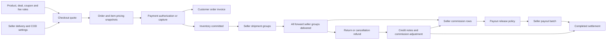

# Order to Seller Payout Flow

Implementation review date: 2026-06-29  
Repository revision reviewed: `c047f2b`  
Default API prefix: `/api/v1`

## 1. Purpose and scope

This document describes the backend implementation for the financial and operational path from checkout pricing to seller settlement. It covers only:

- platform fees;
- platform commission;
- shipping charges and serviceability;
- coupons and discounts;
- orders and order status;
- taxation/GST;
- fulfillment;
- returns, cancellations, and refunds;
- invoices and credit notes; and
- seller commission, payout, and settlement.

It documents the code as implemented, including important inconsistencies. It is not a statement of GST, TCS, accounting, or legal correctness.

## 2. Executive summary

The marketplace creates one parent PostgreSQL order for the buyer. Seller ownership is represented by `order_items.seller_id` and, where present, `order_items.organization_id`; there is no physical seller-order table.

Checkout performs the authoritative pricing calculation. It snapshots product price, discount, tax, seller fee, fee tax, shipping charge, and expected seller payout data onto the order and its items. Those snapshots are later used to calculate seller commission ledger rows after delivery.

The canonical order-to-payout tables are:

1. `orders` and `order_items` — commercial snapshot;
2. `seller_commissions` — one payable ledger row per seller/organization/order;
3. `seller_payouts` — a batch of eligible commission rows;
4. `seller_settlements` — the completed payout or a negative post-payout adjustment.

`vendor_payouts`, exposed through `/admin/payouts`, is a separate legacy/manual record. It is not linked to order items or `seller_commissions` and is not the canonical order-to-seller payout path.



## 3. Storage and ownership model

| Area | Store | Main records | Role in this flow |
| --- | --- | --- | --- |
| Catalog and product tax/shipping metadata | MongoDB | products and variants | Checkout input and immutable order snapshots |
| Coupons | MongoDB | `Coupon` | Cart-level discount validation and usage count |
| Modern commission and platform-fee rules | MongoDB | `CommissionRule`, `PlatformFeeRule` | Seller/customer fee calculation |
| Inventory | MongoDB | products, inventory reservations and transactions | Reserve, commit, release, restock, and damage tracking |
| Returns | MongoDB | `Return` | Seller-split return, QC, reverse logistics, and refund state |
| Orders and payments | PostgreSQL | `orders`, `order_items`, `payments` | Authoritative commercial and payment records |
| Shipping | PostgreSQL | serviceability, rates, shipments, tracking, manifests, e-way bills | Forward and reverse logistics |
| Tax | PostgreSQL | invoices, credit notes, and tax ledger entries | Customer/seller/platform documents and tax postings |
| Seller finance | PostgreSQL | commissions, payouts, settlements | Payable release, batching, payment completion, and recovery |
| Policies | PostgreSQL | `admin_settings`, `seller_charge_settings`, `shipping_profiles` | Runtime checkout, delivery, COD, and payout behavior |

The cross-database checkout operation is compensating rather than atomic. Inventory and wallet operations occur before the PostgreSQL order insert; failures trigger best-effort release and order deletion. There is no transaction spanning MongoDB, PostgreSQL, payment providers, and event publication.

## 4. Pricing, fee, and payout terminology

The code uses “commission” and “platform fee” in overlapping ways:

- A `CommissionRule` is always seller-borne and represents marketplace commission.
- A `PlatformFeeRule` can be seller-borne or customer-borne through `chargeToCustomer`.
- `order_items.platform_fee_amount` stores the combined seller deduction: commission plus any seller-borne platform fee.
- `orders.platform_fee_amount` stores seller-borne and customer-borne fees together.
- `seller_commissions.commission_amount` is populated from `order_items.platform_fee_amount`; it therefore combines platform commission and seller-borne platform fee rather than keeping them as separate ledger columns.

For finance reconciliation, the item `pricing_snapshot` and order `platform_fee_breakup` are the only records that preserve the rule-level split.

## 5. Checkout calculation

Primary implementation: `PricingService.priceOrder()` in `src/modules/pricing/services/pricing.service.js`.

### 5.1 Item price

For each requested item:

1. Load the active product and selected active variant.
2. Reject unavailable stock unless backorders are enabled.
3. Use variant sale price/price, falling back to product sale price/price.
4. Replace the unit price with an active deal price where applicable.
5. Compute:

```text
lineTotal = unitPrice * quantity
subtotalAmount = sum(lineTotal)
```

The resulting product, variant, seller, organization, warehouse, deal, fulfillment, HSN, GST, and shipping data are copied to the order item snapshot.

### 5.2 Coupon and discount

Coupons support percentage and fixed discounts. Validation checks:

- active state and start/expiry dates;
- global usage limit;
- per-customer usage count based on non-cancelled/non-payment-failed PostgreSQL orders;
- minimum order amount; and
- optional maximum discount for percentage coupons.

The cart-level discount is capped at the subtotal and distributed proportionally:

```text
itemDiscount = orderDiscount * itemLineTotal / subtotal
discountedLineTotal = itemLineTotal - itemDiscount
customerItemsAmount = subtotal - orderDiscount
```

The discount reduces the seller payout base. There is no separate coupon-funding ledger to distinguish platform-funded and seller-funded promotions.

Coupon usage is incremented after order creation. The increment is not transactional with order creation, and cancellation/refund does not decrement it.

### 5.3 Product GST

Tax data comes from the HSN rule when available; otherwise it falls back to product GST data and finally 18%. Checkout supports inclusive and exclusive product pricing.

For GST-inclusive items:

```text
taxable = discountedLineTotal * 100 / (100 + gstRate + cessRate)
GST = taxable * gstRate / 100
cess = discountedLineTotal - taxable - GST
taxPayableAtCheckout = 0
```

For GST-exclusive items:

```text
taxable = discountedLineTotal
GST = taxable * gstRate / 100
cess = taxable * cessRate / 100
taxPayableAtCheckout = GST + cess
```

Exports are zero-rated. Otherwise, the implementation chooses CGST/SGST only when product origin state and buyer state both equal `BUSINESS_STATE`; all other cases use IGST.

`orders.tax_amount` includes GST already embedded in inclusive prices, while the customer total adds only `taxPayableAmount`. This is intentional in the pricing formula but important when reading order totals.

### 5.4 Commission and platform-fee rules

Modern rules are selected by specificity plus priority:

```text
product > category > seller > organization > global
score = specificity + priority
```

A deal commission snapshot overrides the normal commission rule. Fee types support percentage, fixed, or mixed calculations. A rule may apply to product amount, order subtotal, or final paid amount, although the order-level amount is allocated back to items proportionally.

Per item:

```text
commission = percentage component + fixed component
sellerPlatformFee = platform fee when chargeToCustomer = false
customerPlatformFee = platform fee when chargeToCustomer = true
sellerFeeTotal = commission + sellerPlatformFee
```

When no modern rule exists at all, checkout falls back to the legacy PostgreSQL `platform_fee_config` category rules. If neither source returns a rule, the fee is zero.

Seller fee GST is controlled globally rather than by the selected rule:

```text
platformFeeTax = sellerFeeTotal * finance.platformFeeTaxRate / 100
```

It is applied only when `finance.chargePlatformFeeTaxToSeller` is true.

### 5.5 Shipping and COD charges

Checkout groups items by `(sellerId, organizationId)` and applies the resolved `seller_charge_settings` for each group. Organization settings fall back to seller-wide settings.

Delivery charge modes are:

- `none` — zero unless a product shipping rule supplies a charge;
- `flat`;
- `free_over_amount`;
- `product`;
- `order`;
- `region`; and
- `rule_based`.

Product-mode charges are multiplied by item quantity. Rule-level handling charges and the seller-wide delivery handling charge can both be added.

COD requires all of the following:

- platform COD availability allows the address;
- the PostgreSQL COD method configuration is enabled and its order range matches;
- every seller/organization COD policy allows the address and seller group amount; and
- no matching product or region delivery rule disables COD.

```text
codCharge = platformCodCharge + sum(sellerFlatCodCharge)
```

### 5.6 Customer total and seller estimate

```text
customerTotal =
    customerItemsAmount
  + exclusiveProductTax
  + deliveryCharge
  + codCharge
  + customerPlatformFee
  + customerPlatformFeeTax

customerPayable = customerTotal - walletApplied
```

The current modern fee implementation always returns zero customer platform-fee tax.

Seller payout estimate per item:

```text
payoutBase = taxableAmount                  when sellerPayoutBase = taxable_ex_gst
payoutBase = discountedLineTotal            when sellerPayoutBase = gross_customer_price

itemPayout = max(0, payoutBase - sellerFeeTotal - platformFeeTax)
```

Shipping policy then changes the estimate:

- `not_in_seller_payout` — no change;
- `reimburse_seller` — add the seller delivery charge; or
- `deduct_from_seller` — subtract the seller delivery charge.

Wallet usage reduces what the buyer pays externally; it does not reduce seller payout.

## 6. Order creation and payment

Primary implementations:

- `OrderService.createOrder()` and payment state methods;
- `PaymentService.initiatePayment()`, `verifyPayment()`, and `handleWebhook()`; and
- `OrderRepository.createOrder()`.

### 6.1 Creation sequence

1. Reuse an existing order when the buyer/idempotency key matches.
2. Recalculate the complete quote server-side.
3. Reserve inventory for 15 minutes.
4. Hold the requested wallet amount.
5. Insert `orders`, `order_items`, initial status history, and the order-created outbox event in one PostgreSQL transaction.
6. Reserve deal sales.
7. Increment coupon usage.
8. If payable is zero, capture wallet, commit inventory, confirm the order, create its customer invoice, and clear purchased cart items.

New payable orders start as:

```text
order.status = pending_payment
order.payment_status = initiated
```

### 6.2 Payment paths

| Method | Initial payment result | Order result |
| --- | --- | --- |
| Razorpay | `initiated`, then `captured` after verify/webhook | `confirmed` after capture |
| Wallet-only | allowed only when payable is zero | `confirmed`, `captured` |
| COD | payment row `authorized` | order `confirmed`, payment `authorized` |
| Manual UPI/bank | payment row `initiated` | remains pending until admin approval |

Payment capture or authorization commits inventory, commits deal sales, creates the aggregate order invoice, and clears purchased cart items. Payment failure releases inventory, wallet, and deal reservations and moves the order to `payment_failed`. A retry moves it back to `pending_payment` after reserving inventory again.

Razorpay payment and refund webhooks use a PostgreSQL idempotency/audit table. COD is authorization-only in this path; there is no implemented COD cash-receivable reconciliation that later captures the payment automatically.

## 7. Order and delivery status

### 7.1 Order state machine

The effective service transitions are:

```text
pending_payment -> confirmed | payment_failed | cancelled
payment_failed  -> pending_payment | cancelled
confirmed       -> packed | cancelled
packed          -> shipped | cancelled, but only before courier handover
shipped         -> delivered
delivered       -> fulfilled | return_requested
fulfilled       -> return_requested
return_requested -> partially_returned | returned
partially_returned -> return_requested | fulfilled
```

`cancelled` is terminal. `returned` is effectively terminal through `OrderService`, even though the shared generic transition map also lists `returned -> fulfilled`.

Order, payment, and delivery states are separate fields. Every repository status update appends `order_status_history`, including same-status updates used to update delivery state.

### 7.2 Seller scoping

The parent order is not split. Seller views filter items, invoices, shipments, settlements, and calculated totals by seller, optionally by organization. `relations.sellerFulfillmentGroups` is the derived seller-level read model.

### 7.3 Shipment state machine

Forward shipment states are:

```text
initiated -> manifested | picked_up | in_transit | cancelled | failed
manifested -> picked_up | in_transit | cancelled | failed
picked_up -> in_transit | failed | rto | lost | damaged
in_transit -> out_for_delivery | failed | rto | lost | damaged
out_for_delivery -> delivered | delivered_verified | failed | rto | lost | damaged
delivered -> delivered_verified
```

Creating a shipment for a confirmed order normally moves the parent order to `packed`. Tracking maps `in_transit`/`out_for_delivery` to `shipped`. The parent reaches `delivered` only when every seller represented in the order has a delivered forward shipment.

Delivery verification can require OTP, signature, photo, QR, courier API, or admin override. Verified delivery is stored as `delivered_verified`; both `delivered` and `delivered_verified` count as delivered for order and commission processing.

Inventory must already be committed before the order can enter packed, shipped, delivered, or fulfilled states.

## 8. Shipping location and serviceability

There are three related but separate mechanisms:

1. Global PostgreSQL serviceability:
   - `pincode_serviceability` supplies city, state, zone, COD flag, and ETA;
   - active `delivery_exclusions` can block a pincode;
   - `shipping_rates` calculates base fee + per-kg fee + optional COD fee.
2. Seller charge settings:
   - seller/organization allowlist, blocklist, regions, product rules, order rules, charge, ETA, and COD rules;
   - this is the mechanism enforced by checkout.
3. Shipping profiles:
   - seller/organization profiles with selected states, cities, pincodes, blocklists, charge, COD, and ETA;
   - a product may reference `shipping.shippingProfileId`.

`GET /delivery/serviceability` evaluates the global tables and, for a supplied product, its shipping profile or seller settings. `GET /delivery/rates` evaluates the global zone/rate tables.

Important: checkout does not call the global serviceability/rate repository and does not load `shipping_profiles`. It enforces seller charge settings plus inline product `shipping` data. A product shipping profile can therefore affect the public serviceability response without necessarily affecting checkout. The global calculated shipping rate is also separate from the checkout delivery charge.

## 9. Taxation and GST records

Primary implementation: `TaxService` and `TaxRepository`.

### 9.1 Document types

| Type | Issuer -> recipient | Creation |
| --- | --- | --- |
| `order_customer` | platform -> buyer | automatic after payment authorization/capture |
| `seller_customer` | seller -> buyer | explicit marketplace bundle generation, or lazily during refund credit-note generation |
| `platform_commission` | platform -> seller | explicit marketplace bundle generation, or lazily during refund credit-note generation |

The marketplace bundle is grouped by `(sellerId, organizationId)`. The order invoice is its parent, the seller invoice covers that seller’s items and delivery charge, and the commission invoice covers seller-borne marketplace fees plus configured fee GST.

The aggregate order invoice records a fixed 1% TCS amount in `tax_invoices.tcs_amount` and `tax_ledger_entries`. TCS is not added to the customer invoice total and is not deducted by the seller payout implementation.

### 9.2 Tax ledger

Invoice creation posts positive `tax_collected` ledger entries. Credit-note creation posts `tax_reversed` entries for CGST, SGST, and IGST.

Tax reports group these entries by organization, component, and entry type. GST filing rows exist in the Sequelize model/migration but are not generated by the order flow.

### 9.3 Invoice and credit-note idempotency

- The aggregate order invoice is reused by order ID and invoice type.
- Seller and commission invoices are reused by order, type, seller, organization, and reference.
- Credit notes are reused by `(reference_type, reference_id)`.

Document output supports PDF, HTML, text, JSON, and relevant CSV exports. Email dispatch is implemented; WhatsApp dispatch is an auditable queue placeholder rather than a live provider integration.

## 10. Fulfillment

Fulfillment is seller-group based even though status remains on the parent order.

1. Payment authorization/capture commits inventory.
2. A seller or admin creates a shipment for seller-owned items.
3. Shipment creation snapshots pickup, destination, package, rate, provider label, deal fulfillment, verification requirement, and optional delivery agent.
4. Tracking updates can be manual or webhook-driven.
5. Multi-seller delivery is aggregated; partial seller delivery leaves the order `shipped` with delivery status `partially_delivered`.
6. Once all forward seller groups are delivered, the order becomes `delivered` and seller commission calculation is invoked.
7. `fulfilled` is a later explicit seller/admin order transition and also invokes commission calculation idempotently.

The shipping provider registry currently always has a manual provider and can wrap future providers. E-way bill data is stored separately and is not automatically generated from an invoice.

## 11. Cancellation, return, and refund

### 11.1 Pre-shipment cancellation

Cancellation supports full or item-level cancellation while the order is pending payment, payment failed, confirmed, or packed before handover. A packed seller shipment can only be cancelled as a complete seller package.

The flow:

1. Calculate item, discount, tax, wallet, COD, and provider refund allocation.
2. Cancel eligible shipments.
3. Release or restock item inventory.
4. Release held wallet value or credit captured wallet value.
5. Request a Razorpay refund, or move unsupported providers to manual review.
6. Project cancelled quantities and cancellation status onto order items/order.
7. Update payment state.
8. Create marketplace credit notes when an invoice exists.
9. Adjust seller commission when a commission row already exists.

Partial cancellation leaves the parent order status unchanged and uses `cancellation_status = partially_cancelled`. Full cancellation moves it to `cancelled`.

### 11.2 Post-delivery return

Returns can be requested only for delivered, fulfilled, return-requested, or partially-returned orders. A multi-seller request is split into one MongoDB return per seller.

The effective return flow is:

```text
requested
  -> approved | rejected
approved
  -> reverse_pickup_scheduled | manual_ship_back | received
reverse logistics
  -> received
received
  -> qc_passed | qc_completed | qc_failed
qc_passed/qc_completed
  -> refund_pending -> refunded | refund_failed
  -> replacement_pending -> replaced
terminal result
  -> closed
```

The return window is the smallest configured positive window from product snapshots and seller settings, falling back to order metadata or 7 days. QC restocks sellable items and records damaged items separately. Missing or rejected items receive no refund.

### 11.3 Return refund calculation and methods

Initial return estimate:

```text
proportion = returnedItemSubtotal / orderSubtotal
discountReversal = orderDiscount * proportion
taxReversal = orderTax * proportion
refund = returnedItemSubtotal - discountReversal + taxReversal
```

Shipping is not refunded by the return formula.

Supported refund allocations are:

- wallet/store credit;
- original Razorpay payment;
- split wallet + Razorpay;
- manual; and
- `auto`, which uses Razorpay when refundable and wallet otherwise.

Refund attempts are idempotent and provider-pending refunds are finalized by sync or webhook. Finalization creates aggregate, seller, and proportional commission credit notes; adjusts seller finance; updates the parent order/payment refund state; and emits return/refund events.

### 11.4 Parent order after returns

- Any open return makes the order `return_requested`.
- A completed partial quantity/amount return makes it `partially_returned`.
- Full returned quantity makes it `returned`.
- Payment becomes `partially_refunded` or `refunded` based on cumulative completed return amount.

## 12. Seller commission ledger

Primary implementation: `SellerCommissionService.calculateCommission()`.

Calculation runs when the parent order becomes delivered or fulfilled. It groups order items by `(sellerId, organizationId)` and upserts one `seller_commissions` row for the order group.

```text
amount = sum(item seller payout base snapshot)
commissionAmount = sum(order_items.platform_fee_amount)
commissionAmount = tier fallback rate * amount only when item fees total zero
commissionTax = commissionAmount * current commerce platformFeeTaxRate
netAmount = amount - commissionAmount - commissionTax - refundAmount
```

New rows use `pending`. Recalculation updates unpaid rows and skips paid rows. The database uniqueness key is seller + normalized organization + order.

A refund increases `refund_amount` and recomputes `net_amount`. If the commission is already paid, the service also inserts a negative pending settlement for recovery from a future payout. Recovery can later be offset, collected from the seller, or written off.

## 13. Payout release, batching, and settlement

### 13.1 Release policy

Runtime settings support:

- `confirmed` — available at confirmed or later states;
- `delivered_or_fulfilled` — available at delivered, fulfilled, or partially returned;
- `return_window_closed` — available after delivery plus configured release days.

Pending payment, payment failed, cancelled, return requested, and returned orders are blocked. Commissions already in a payout or paid are not released again.

### 13.2 Payout creation

`initiatePayout()`:

1. Locks pending/approved, unbatched commission rows for one seller/organization and date range.
2. Re-evaluates every row against current order state and release policy.
3. Sums gross, commission, commission tax, refunds, adjustments, and net.
4. Offsets pending negative settlements.
5. Enforces positive net and the minimum payout amount.
6. Creates a `seller_payouts` row.
7. Marks selected commissions approved and attaches `payout_id`.

The payout starts `pending` when manual approval is required; otherwise it starts `processing`.

### 13.3 Payout lifecycle

```text
pending -> processing -> completed
pending/processing -> on_hold
non-completed -> failed
failed -> new retry batch
on_hold -> pending | processing
```

Completing a payout:

- records the supplied payment method/reference;
- marks attached commission rows `paid`;
- inserts a completed `seller_settlements` statement; and
- marks offset negative settlements completed.

Failing a payout releases its commission rows back to pending and releases negative offsets. Processing is bookkeeping only: the service does not call a bank or payout provider.

### 13.4 Scheduler

When cron is enabled, the payout scheduler runs every six hours. Policy behavior is:

- manual — skip;
- daily — run every scheduler tick;
- weekly — run on Monday UTC;
- monthly — run on the first day of the month UTC.

Manual approval still applies to scheduler-created batches.

## 14. Runtime settings

| Setting | Default | Effect |
| --- | --- | --- |
| `finance.sellerPayoutBase` | `gross_customer_price` | Gross discounted line or taxable ex-GST payout base |
| `finance.platformFeeTaxRate` | 18 | GST charged on seller fee |
| `finance.chargePlatformFeeTaxToSeller` | true | Deduct fee GST from seller |
| `finance.shippingPolicy` | `not_in_seller_payout` | Quote-time shipping reimbursement/deduction policy |
| `finance.payoutReleaseMilestone` | `delivered_or_fulfilled` | When commissions become available |
| `finance.payoutReleaseDaysAfterDelivery` | 7 | Return-window delay |
| `finance.payoutSchedule` | `manual` | Automatic batch cadence |
| `finance.payoutManualApprovalRequired` | true | Create pending rather than processing payout |
| `finance.minimumPayoutAmount` | 0 | Minimum batch net |
| `cod.payoutRequiresCapture` | true | Stored and exposed, but not enforced by payout eligibility |

Commerce settings are stored in `admin_settings` under `commerce_policy`. Order metadata snapshots checkout settings, but seller commission release uses current settings at the time it runs.

## 15. Main API surface

All paths below assume `/api/v1`.

| Area | Important endpoints |
| --- | --- |
| Quote/order | `POST /orders/quote`, `POST /orders`, `GET /orders/:orderId`, `PATCH /orders/:orderId/status`, `POST /orders/:orderId/cancel` |
| Payment | `GET /payments/options`, `POST /payments/initiate`, `POST /payments/verify`, `POST /payments/webhooks/razorpay`, manual approve/reject endpoints |
| Coupon | CRUD under `/pricing/coupons` |
| Fee rules | CRUD under `/admin/finance/commission-rules` and `/admin/finance/platform-fee-rules` |
| Legacy fee fallback | CRUD under `/subscriptions/admin/platform-fee-config` |
| Commerce policies | `GET/PUT /admin/commerce-settings` |
| Seller delivery/COD policies | `GET/PUT /sellers/me/charge-settings`; admin versions under `/admin/commerce-settings/seller-charge-settings` |
| Serviceability | `GET /delivery/serviceability`, `GET /delivery/rates` |
| Shipping profiles | CRUD and set-default under `/shipping-profiles` |
| Fulfillment | shipment list/create/get/tracking, webhook, manifests, delivery OTP/confirm, delivery agents, and e-way bills under `/delivery` |
| Returns | request/list/get, approve/reject, reverse shipment, receive, QC, refund/retry/sync, replacement, and close under `/returns` |
| Cancellations | get/list/retry/manual refund under `/cancellations`; creation through the order cancel endpoint |
| Tax | order invoice, marketplace bundle, invoice/credit-note list/download/dispatch/export, and reports under `/tax` |
| Seller finance | commissions, wallet summary, payouts, settlements, exports, statements, payout operations, and recoveries under `/sellers/commissions` |
| Canonical payout actions | `POST /sellers/commissions/process-payouts`; approve/process/fail/hold/release/retry endpoints under `/sellers/commissions/payouts` |
| Legacy manual payout | `POST/GET /admin/payouts` using `vendor_payouts` |

RBAC is enforced through action/permission middleware. Seller reads are scoped using the authenticated owner seller and selected organization where the route passes that context.

## 16. Events and idempotency

Order creation and payment records write outbox events in their PostgreSQL transactions. Most later modules publish directly through the event publisher.

Key events include order created/paid/status/cancelled, payment initiated/verified/failed/refunded, shipment created/tracking/delivered/verified, invoice and credit note generated, return requested/approved/received/refunded, and inventory/wallet changes.

There are no seller commission, payout-created, payout-approved, payout-completed, or settlement-created domain events.

Important idempotency controls include:

- buyer order idempotency key in order metadata;
- payment idempotency key and provider webhook claim table;
- shipment and shipment-tracking idempotency keys;
- return refund attempt idempotency keys;
- cancellation idempotency key;
- invoice/reference reuse; and
- commission unique upsert scope.

## 17. Known reconciliation and production gaps

These are implementation findings, not hypothetical roadmap items.

### Critical

1. **COD capture is not enforced before payout.** `cod.payoutRequiresCapture` is stored and displayed, but release evaluation checks order status, not payment capture. A delivered COD order with an authorized payment can become payout-eligible.
2. **No payout provider or bank/KYC readiness check exists.** Completing a payout only records a caller-supplied reference. The flow does not verify seller bank, KYC, go-live, or organization payout readiness and does not transfer money.
3. **Quote shipping policy and payout ledger can disagree.** Checkout adds/reduces seller payout for `shippingPolicy`; `seller_commissions` does not include shipping reimbursement or deduction. Actual payout rows therefore omit this quoted adjustment.
4. **Fee-tax settings can drift after checkout.** Commission tax is recomputed at delivery using current commerce settings instead of the item’s snapshotted `platformFeeTaxAmount`.
5. **Unmatched modern rules can create a quote-to-payout commission jump.** If any modern rules exist but none match an item, checkout can snapshot zero seller fee. At delivery the commission ledger falls back to the default bronze rate (15%) whenever the snapshotted item fee total is zero; it does not load the seller’s actual tier.
6. **Refund after payout batching can overpay.** A refund updates an approved/processing commission row but does not recompute the already-created `seller_payouts` totals. Negative recovery is created only when commission status is `paid`.
7. **GST-inclusive partial refunds can add tax twice.** Return and partial-cancellation estimates start from `line_total`, which normally already includes GST, and then add a proportional `tax_amount`. This can overstate the buyer refund and seller adjustment for the default GST-inclusive product mode.
8. **Tax reporting can double-count product tax.** The aggregate order invoice posts product GST, and each seller-customer invoice posts the same product GST again when marketplace invoices are generated. Tax reports sum both ledger sets without document-type exclusion.
9. **Marketplace invoice item component splits are incomplete.** Item tax snapshots store tax mode and total tax but not item CGST/SGST/IGST fields. Seller invoice component totals can remain zero while `tax_amount` is non-zero.
10. **A buyer can directly mark an order delivered.** The generic order status endpoint permits the order owner to perform `shipped -> delivered`. That path synchronizes shipments to delivered and calculates seller commission without requiring courier tracking or delivery verification.

### High

1. **Checkout and public serviceability can disagree.** Global pincode exclusions/rates and `shipping_profiles` are not authoritative in checkout.
2. **Unscoped payout batch discovery uses obsolete statuses.** `processBatchPayouts()` looks for `calculated`/`failed` when organization is omitted, but commission calculation creates `pending`; seller-wide manual/scheduled payout discovery can therefore return no organization groups. Explicit organization-scoped runs avoid that discovery branch.
3. **Legacy payout APIs bypass the canonical ledger.** `/admin/payouts` can create arbitrary `vendor_payouts` with no commission linkage, release policy, refund adjustment, approval workflow, or settlement row.
4. **Manual payout approval can be bypassed.** `processPayout()` accepts a `pending` payout, so an authorized caller can call the process endpoint without first calling approve. It also accepts `failed`; after failure has detached the commissions, direct processing can complete the old payout and create a settlement with no commissions attached.
5. **TCS is incomplete for settlement accounting.** The aggregate invoice records fixed 1% TCS, but payout does not withhold it and credit notes do not reverse TCS ledger entries.
6. **No automated marketplace invoice bundle on payment.** Only the aggregate order invoice is automatic. Seller and commission invoices require an explicit bundle request or a later refund path.
7. **Invoice numbering is race-prone.** The next number is `COUNT(*) + 1`, which can collide under concurrent generation.
8. **Partial cancellation tax uses proportional item totals, not the item tax breakup components.** This can diverge from exact tax/credit-note allocation after mixed rates or rounding.
9. **A return “manual” refund is only a state transition.** It can finalize immediately without a required bank/cash transfer reference or proof; no external movement is performed.

### Medium

1. Rule-level fee tax returned by `computeRuleFee()` is not used; seller fee GST comes from the global commerce setting, and customer fee tax is currently zero.
2. `tiered` exists in the platform-fee schema but has no tier calculation branch in checkout.
3. Coupon usage increment is not atomic with order creation and is not reversed on cancellation.
4. GST rate fallback uses truthy `||` expressions; an explicit zero rate without an exempt HSN rule can fall through to 18%.
5. Global shipping rate/COD fee and seller checkout delivery/COD charges are separate calculations and can show different amounts.
6. Organization-aware checkout groups charges correctly, but some order read-model shipping lookup code keys only by seller and can misattribute charge display when one seller has multiple organizations in one order.
7. Direct organization charge-setting reads have an argument-order defect in the seller-fallback branch; checkout uses the separate bulk settings path, but seller/admin read-update behavior can be incorrect when only seller-wide settings exist.
8. The repository has no project test script or automated unit/integration suite for this flow; current verification depends on syntax checks and manual/runtime smoke tests.

## 18. Source map

| Concern | Primary code |
| --- | --- |
| Checkout pricing | `src/modules/pricing/services/pricing.service.js` |
| Coupon persistence | `src/modules/pricing/models/coupon.model.js`, `src/modules/pricing/repositories/pricing.repository.js` |
| Fee rules | `src/modules/seller/models/commission-rule.model.js`, `src/modules/seller/models/platform-fee-rule.model.js` |
| Commerce policy | `src/modules/admin/services/commerce-settings.service.js` |
| Seller delivery/COD rules | `src/modules/seller/services/seller-charge-settings.service.js` |
| Order orchestration | `src/modules/order/services/order.service.js` |
| Order persistence/read model | `src/modules/order/repositories/order.repository.js` |
| Payments | `src/modules/payment/services/payment.service.js` |
| Inventory side effects | `src/modules/inventory/services/inventory.service.js` |
| Shipping/serviceability | `src/modules/delivery/services/delivery.service.js`, `src/modules/delivery/repositories/delivery.repository.js` |
| Shipping profiles | `src/modules/delivery/services/shipping-profiles.service.js` |
| Cancellation | `src/modules/cancellation/services/cancellation.service.js` |
| Return/refund | `src/modules/returns/services/return.service.js` |
| Tax/invoices/credit notes | `src/modules/tax/services/tax.service.js`, `src/modules/tax/repositories/tax.repository.js` |
| Seller commission/payout | `src/modules/seller/services/commission.service.js` |
| Scheduler | `src/infrastructure/cron/register-cron.js` |
| Route registration | `src/api/register-routes.js` |
| PostgreSQL schema | `sequelize/migrations/000-core-commerce-foundation.js`, `001-advanced-marketplace-tables.js`, `003-enterprise-ops-and-logistics.js`, and later flow migrations `017`-`019`, `022`, `027`-`033`, `036`, `037` |
